# Компьютерная графика — Лабораторные работы

---

## Лабораторная работа №1 — Анализ изображений

### Статистики

| Изображение | Среднее | Дисперсия | Энтропия (бит) | Энергия GLCM | PSNR (σ²=400) |
|---|---|---|---|---|---|
| checker | 127,50 | 16256,25 | 1,0000 | 0,47330 | 25,13 дБ |
| gradient | 127,25 | 5460,96 | 7,5938 | 0,00392 | 22,50 дБ |
| circles | 84,20 | 2605,92 | 2,1143 | 0,29811 | 22,40 дБ |
| dark | 19,20 | 134,42 | 4,8253 | 0,00140 | 23,52 дБ |
| noise | 127,15 | 2432,49 | 7,6288 | 0,00005 | 22,51 дБ |
| **sonoma_photo** | **138,59** | **1528,27** | **7,0726** | **0,00258** | **22,52 дБ** |
| **imac_blue_photo** | **165,72** | **649,22** | **6,6380** | **0,00100** | **22,45 дБ** |
| **baboon** | **128,64** | **1335,34** | **6,7434** | **0,00185** | **22,50 дБ** |

### GLCM

| checker | gradient | noise |
|---|---|---|
|  |  |  |

| sonoma_photo | imac_blue_photo | baboon |
|---|---|---|
|  |  |  |
|  |  |  |

### PSNR(дисперсия шума)

| checker | sonoma_photo | baboon |
|---|---|---|
|  |  |  |

---

## Лабораторная работа №2 — Преобразование Фурье

### 1D сигналы

### 2D — синтетические изображения

### 2D — реальные изображения

| Исходное | Спектр Фурье | IFFT | Вейвлет-коэф. Хаара |
|---|---|---|---|
|  |  |  |  |
|  |  |  |  |
|  |  |  |  |
|  |  |  |  |
|  |  |  |  |

### Энергетический спектр Хаара — 2D изображения

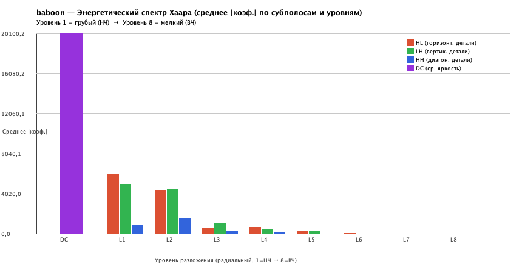

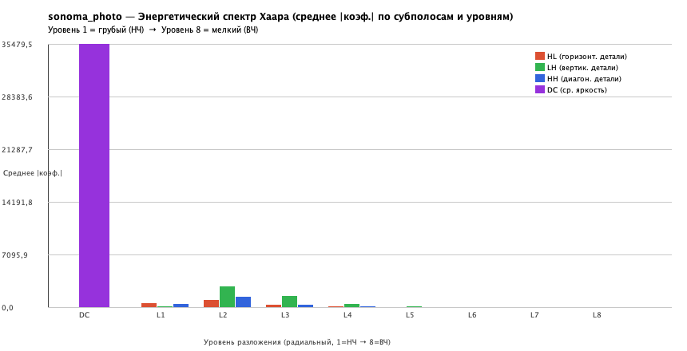

### Сравнение спектров Фурье и Хаара (пирамидальное представление)

### Вейвлет-коэффициенты Хаара и энергетический спектр — 1D сигналы

**Сигнал 1 (sin(50)+0.5·sin(120)+0.25·sin(300)):**

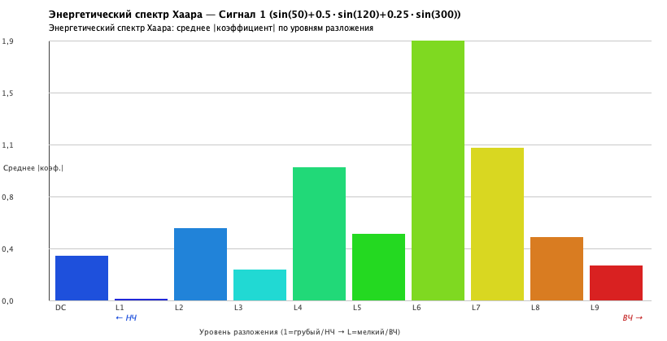

**Сигнал 2 (5 синусоид + гауссов шум):**

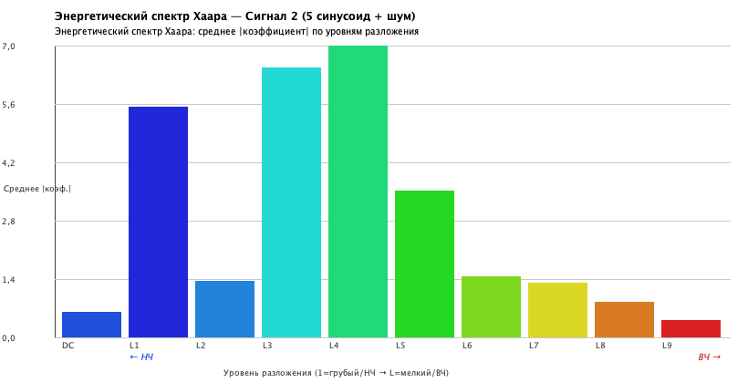

### Спектр Хаара — синтетические изображения

| sin_horizontal | sin_vertical | sin_diagonal | sin_mix |
|---|---|---|---|
|  |  |  |  |

---

## Лабораторная работа №3 — Геометрические преобразования и интерполяция

### Поворот

**baboon:**

| 30° | 45° | 90° | 135° |
|---|---|---|---|
|  |  |  |  |

**checker:**

| 30° | 45° | 90° | 135° |
|---|---|---|---|
|  |  |  |  |

**circles:**

| 30° | 45° | 90° | 135° |
|---|---|---|---|
|  |  |  |  |

**gradient:**

| 30° | 45° | 90° | 135° |
|---|---|---|---|
|  |  |  |  |

**sonoma_photo:**

| 30° | 45° | 90° | 135° |
|---|---|---|---|
|  |  |  |  |

### Время поворота (мс)

| Изображение | Угол | NN | Билинейная | Бикубическая |
|---|---|---|---|---|
| baboon (200×200) | 30° | 7 | 7 | 18 |
| baboon (200×200) | 45° | 1 | 9 | 7 |
| checker (256×256) | 30° | 1 | 1 | 5 |
| checker (256×256) | 45° | 0 | 1 | 5 |
| sonoma_photo (256×256) | 30° | 0 | 1 | 4 |
| sonoma_photo (256×256) | 45° | 0 | 2 | 4 |

Бикубическая интерполяция медленнее (16 соседей vs 4 у билинейной и 1 у ближайшего соседа), зато визуально даёт наиболее гладкий результат без ступенчатости. Ближайший сосед — самый быстрый, но даёт блочные артефакты.

### Скос (shear)

| baboon | checker | circles |
|---|---|---|
|  |  |  |

### Поворот + масштабирование (45°, ×1.5)

| baboon | checker | sonoma_photo |
|---|---|---|
|  |  |  |

### Поворот in-situ (3 скоса, 45°)

| baboon | checker | circles |
|---|---|---|
|  |  |  |

| gradient | sonoma_photo |
|---|---|
|  |  |

| Изображение | PSNR(in-situ vs билинейная, оба — прямой поворот 45°) |
|---|---|
| baboon | 19.25 дБ |
| checker | 17.36 дБ |
| circles | 31.22 дБ |
| gradient | 18.55 дБ |
| sonoma_photo | 19.27 дБ |

---

## Лабораторная работа №4 — Свёртка

### ФНЧ

**baboon:**

**circles:**

**gradient:**

**sonoma_photo:**

### ФВЧ, zero-crossing, резкость

**baboon:**

**circles:**

**gradient:**

**sonoma_photo:**

### PSNR фильтрации (дБ)

| Изображение | Шум | Box 3×3 | Box 7×7 | Gauss σ=2 | Порог | Bilateral |
|---|---|---|---|---|---|---|
| baboon | Гауссов σ²=400 | 24.76 | 23.05 | 23.68 | 24.33 | **25.99** |
| baboon | Импульс 10% | 22.31 | 22.47 | 22.97 | 15.52 | 17.63 |
| circles | Гауссов σ²=400 | 30.37 | 30.11 | 30.98 | 26.11 | **30.48** |
| circles | Импульс 10% | 23.53 | 26.42 | **26.70** | 15.09 | 15.84 |
| gradient | Гауссов σ²=400 | 31.56 | **38.78** | 38.51 | 26.26 | 31.13 |
| gradient | Импульс 10% | 23.39 | **27.91** | 27.79 | 14.77 | 15.43 |
| sonoma_photo | Гауссов σ²=400 | 31.25 | 34.31 | **34.95** | 26.08 | 30.42 |
| sonoma_photo | Импульс 10% | 24.72 | 29.45 | **29.55** | 15.63 | 17.32 |

### Билатеральный фильтр

**baboon:**

**circles:**

**gradient:**

**sonoma_photo:**

### Морфологический градиент (нелинейный ФВЧ)

**baboon:**

**circles:**

**gradient:**

### Оптимальный σ гауссова фильтра

| Изображение | Гауссов шум | Импульсный шум |
|---|---|---|
| baboon | σ=0.75, PSNR=26.08 дБ | σ=1.25, PSNR=23.29 дБ |
| circles | σ=1.25, PSNR=31.73 дБ | σ=2.00, PSNR=26.72 дБ |
| gradient | σ=5.00, PSNR=45.39 дБ | σ=5.00, PSNR=29.73 дБ |
| sonoma_photo | σ=2.00, PSNR=34.95 дБ | σ=3.00, PSNR=30.21 дБ |

**baboon:**

**circles:**

**gradient:**

**sonoma_photo:**

---

## Лабораторная работа №5 — Ранговая фильтрация и морфологические операции

### Сравнение фильтров: гауссов шум (σ²=400)

**baboon:**

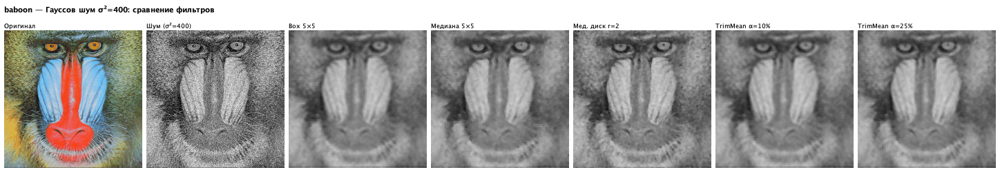

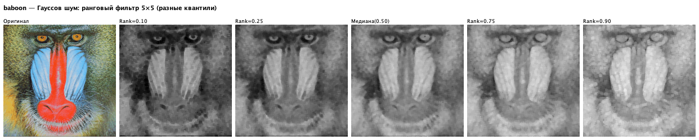

**circles:**

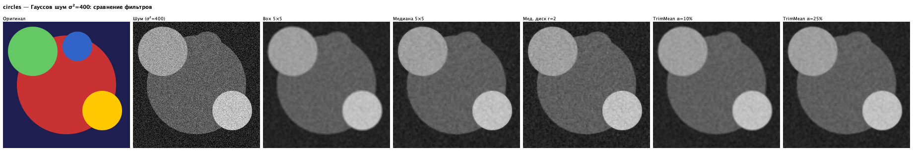

**gradient:**

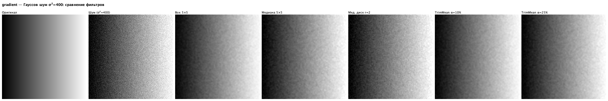

**sonoma_photo:**

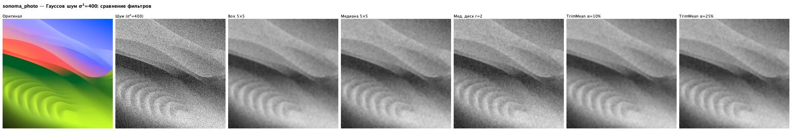

### Сравнение фильтров: импульсный шум (10% соль/перец)

**baboon:**

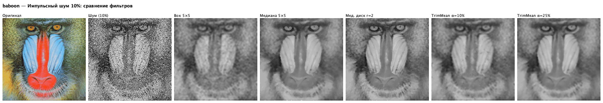

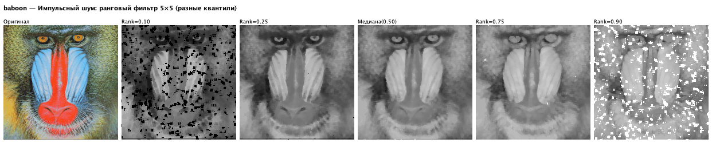

**circles:**

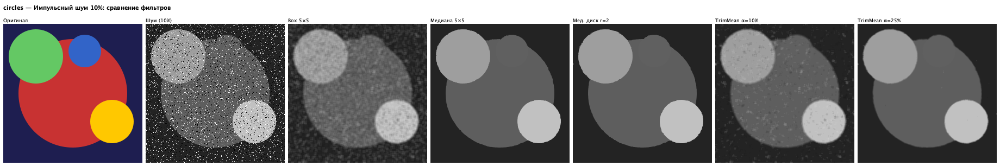

### Морфологические операции (полутоновые)

**baboon — диск r=1:**

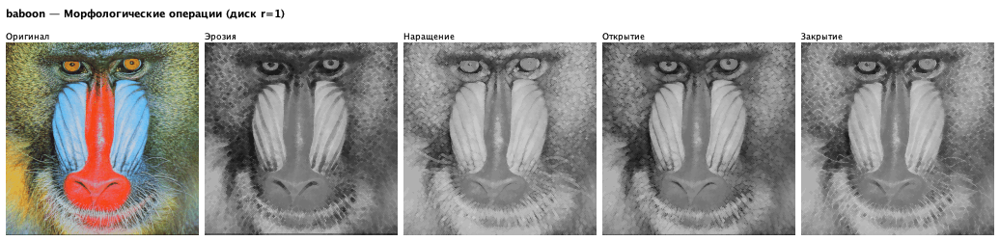

**baboon — верх/низ шляпы и градиент:**

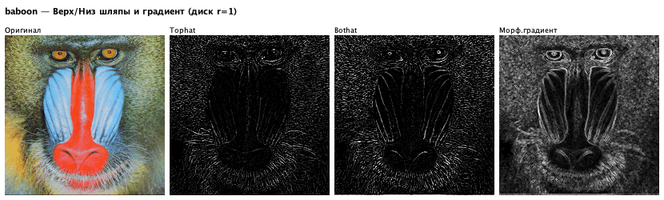

**baboon — диск r=2:**

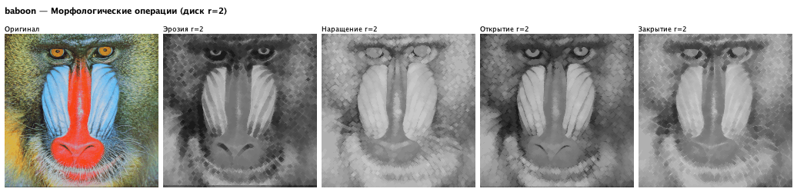

**circles — диск r=1:**

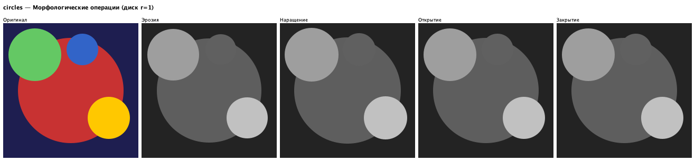

**circles — диск r=2:**

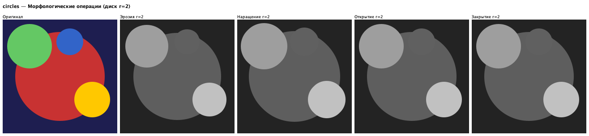

### PSNR сравнение (дБ)

*Числовые значения — в results5/log.txt после запуска Lab5.java.*

---

## Лабораторная работа №6 — Сегментация и вычисление признаков

### circles

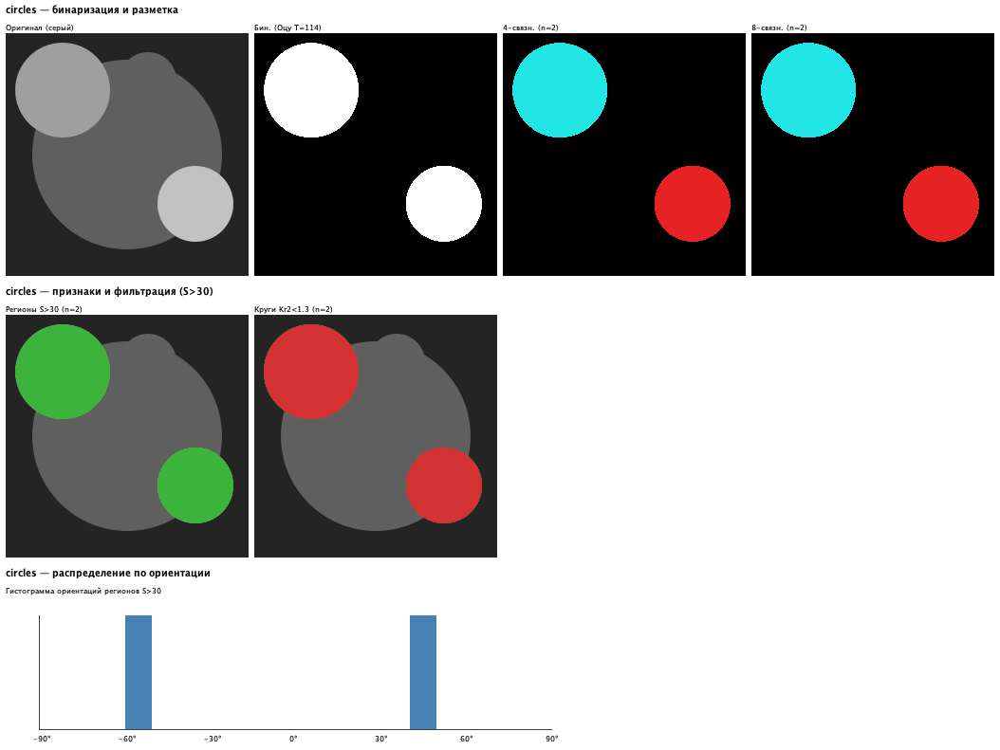

### baboon

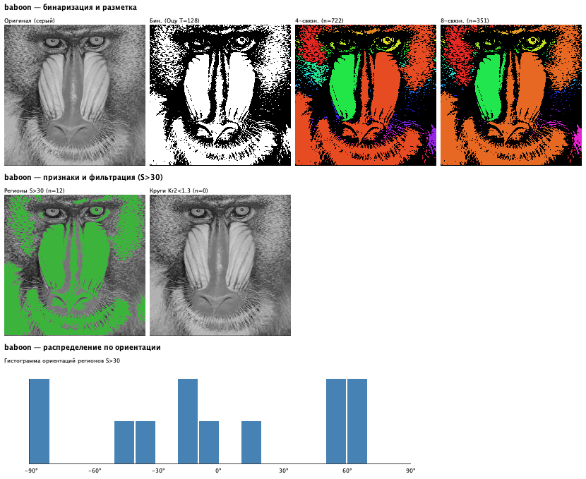

### checker

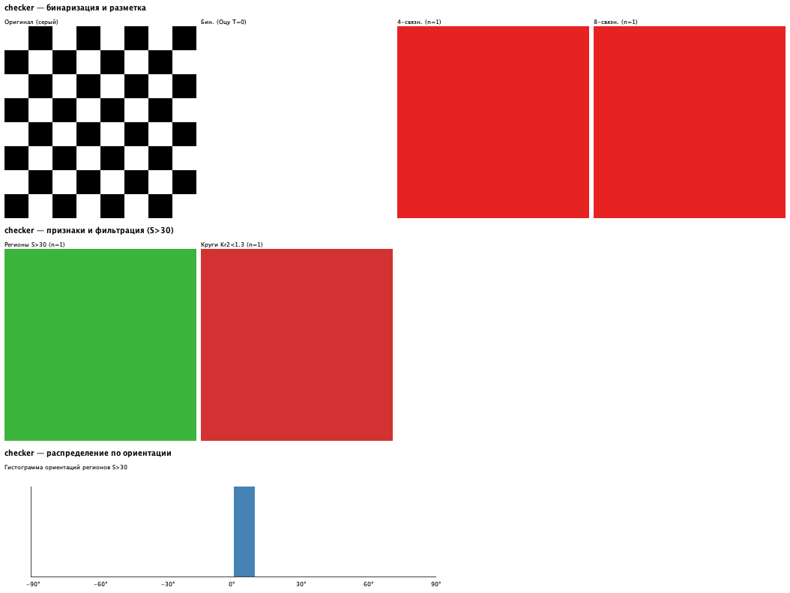

### gradient

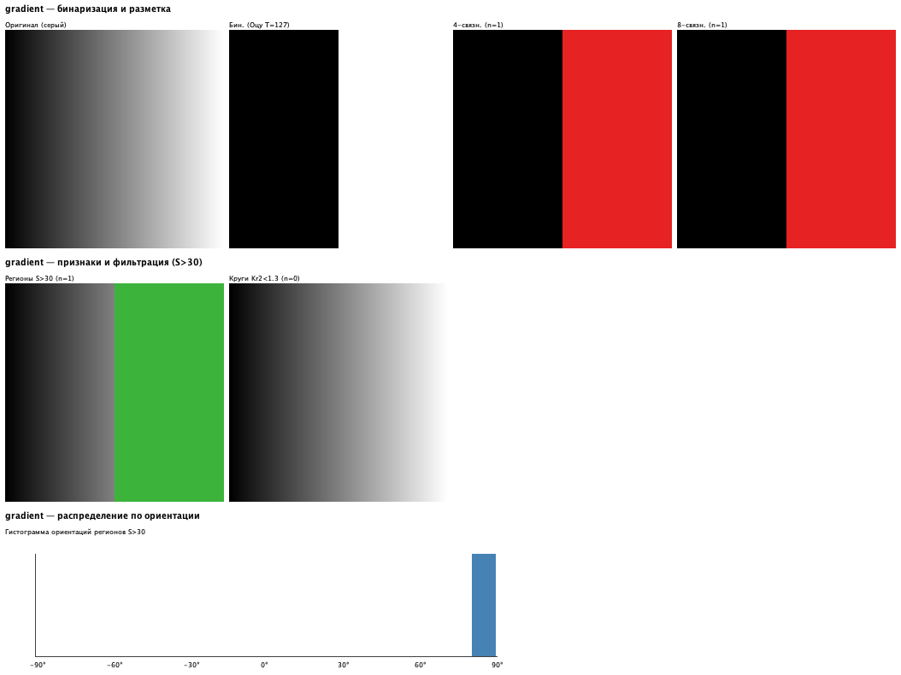

### sonoma_photo

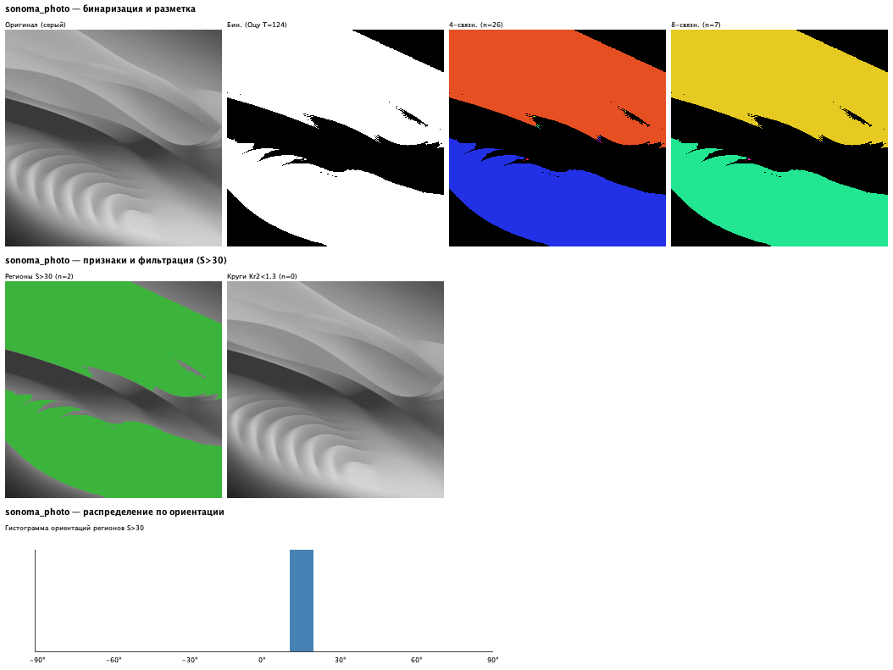

### Результаты (порог Оцу, разметка, признаки формы)

| Изображение | Порог Оцу | 4-св. регионов | 8-св. регионов | Регионов S>30 | Кругов (Kr2<1.3) |
|---|---|---|---|---|---|
| circles | 114 | 2 | 2 | 2 | **2** |
| baboon | 128 | 722 | 351 | 12 | 0 |
| checker | 0 | 1 | 1 | 1 | 1 |
| gradient | 127 | 1 | 1 | 1 | 0 |
| sonoma_photo | 124 | 26 | 7 | 2 | 0 |

*Моменты и полная таблица признаков — в results6/log.txt.*

---

## ДЗ — Улучшение видимости слабоконтрастного текста (9.tif)

**Задача:** изображение содержит одновременно слабоконтрастный светлый текст на тёмном фоне и тёмный текст на светлом фоне. Глобальные методы улучшают один тип контраста за счёт другого — нужен локальный адаптивный метод.

**Критерий качества:** среднее локальное значение контраста Михельсона по тайлам 32×32:
$$Q = \text{mean}_\text{tile}\!\left\{\frac{\max - \min}{\max + \min + 1}\right\} \in [0,1], \text{ выше} = \text{лучше}$$

### Сравнение методов

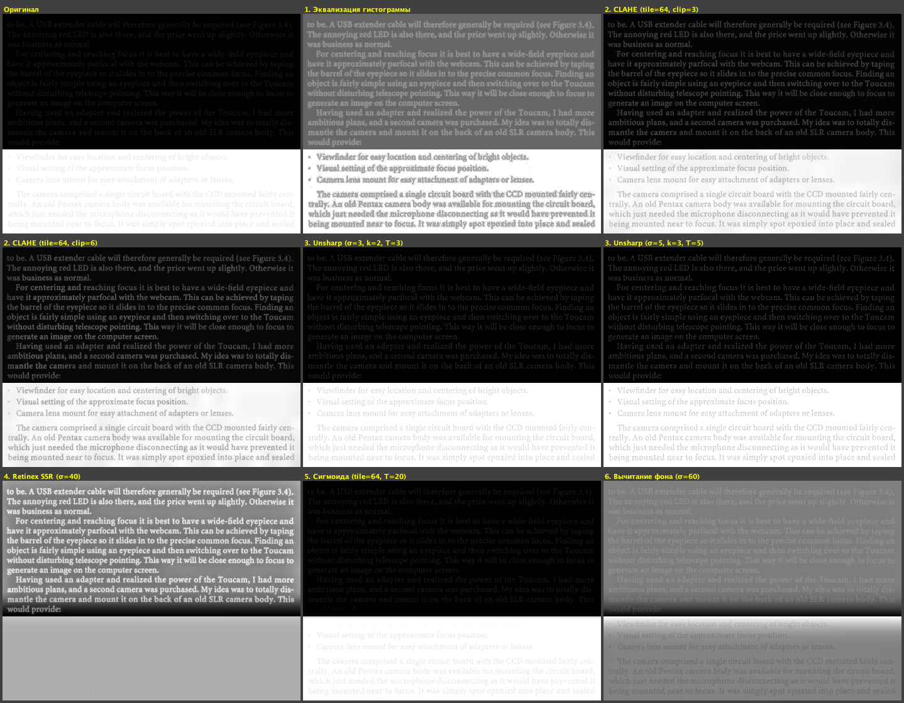

### Результаты критерия

| Метод | Q (↑ лучше) |
|---|---|
| Оригинал | 0.516 |
| Эквализация гистограммы | 0.185 |
| CLAHE (tile=64, clip=3) | **0.520** |
| CLAHE (tile=64, clip=6) | 0.516 |
| Unsharp Mask (σ=3, k=2) | 0.543 |
| **Unsharp Mask (σ=5, k=3)** | **0.561** |
| Retinex SSR (σ=40) | 0.218 |
| Сигмоида (tile=64, T=20) | 0.514 |
| Вычитание фона (σ=60) | 0.119 |

**Вывод:** нерезкое маскирование (σ=5, k=3) даёт наибольший Q=0.56: усиливает высокочастотные перепады (границы текст/фон). CLAHE (clip=3) — предпочтителен при наличии шума (clip ограничивает артефакты). Глобальные методы снижают Q — перераспределяют контраст глобально и «выравнивают» локальные различия.

*Полный анализ — results_dz/log.txt.*
