# Компьютерная графика — Лабораторные работы

---

## Лабораторная работа №1 — Анализ изображений

### Статистики

| Изображение | Среднее | Дисперсия | Энтропия (бит) | Энергия GLCM | PSNR (σ²=400) |
|---|---|---|---|---|---|
| checker | 127,50 | 16256,25 | 1,0000 | 0,47330 | 25,13 дБ |
| gradient | 127,25 | 5460,96 | 7,5938 | 0,00392 | 22,50 дБ |
| circles | 84,20 | 2605,92 | 2,1143 | 0,29811 | 22,40 дБ |
| dark | 19,20 | 134,42 | 4,8253 | 0,00140 | 23,52 дБ |
| noise | 127,15 | 2432,49 | 7,6288 | 0,00005 | 22,51 дБ |
| **sonoma_photo** | **138,59** | **1528,27** | **7,0726** | **0,00258** | **22,52 дБ** |
| **imac_blue_photo** | **165,72** | **649,22** | **6,6380** | **0,00100** | **22,45 дБ** |
| **baboon** | **128,64** | **1335,34** | **6,7434** | **0,00185** | **22,50 дБ** |

### GLCM

| checker | gradient | noise |
|---|---|---|
| 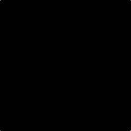 | 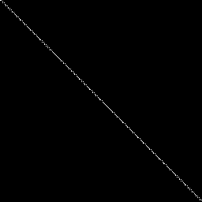 | 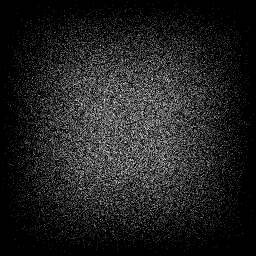 |

| sonoma_photo | imac_blue_photo | baboon |
|---|---|---|
| 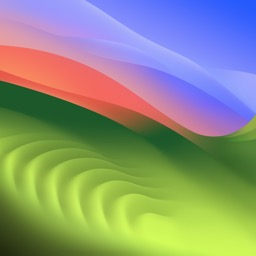 |  | 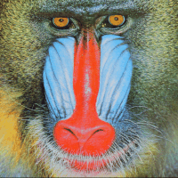 |
| 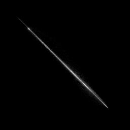 | 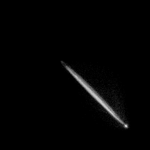 | 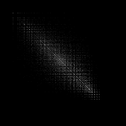 |

### PSNR(дисперсия шума)

| checker | sonoma_photo | baboon |
|---|---|---|
| 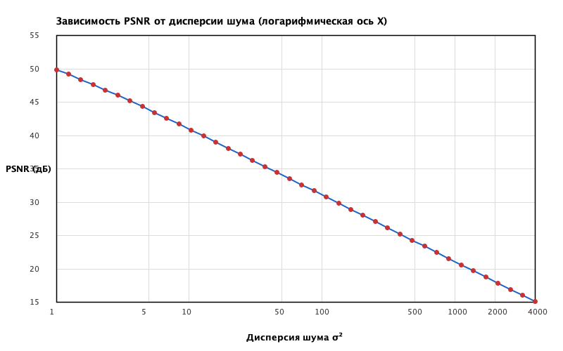 | 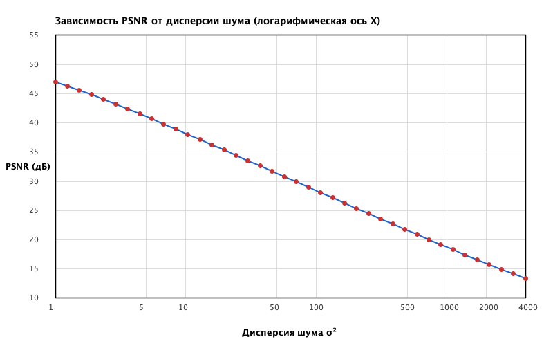 | 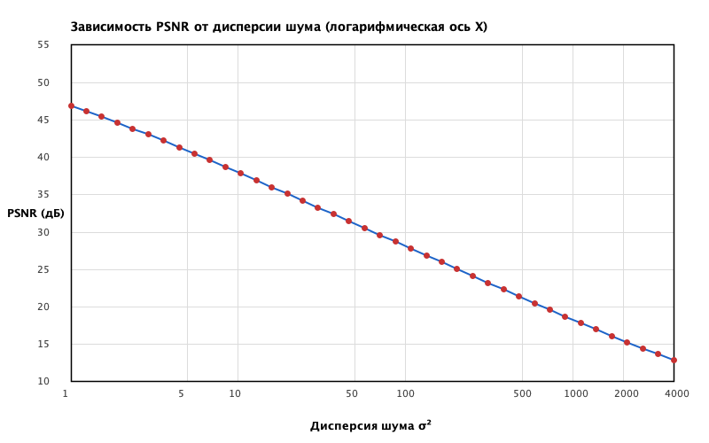 |

---

## Лабораторная работа №2 — Преобразование Фурье

### 1D сигналы

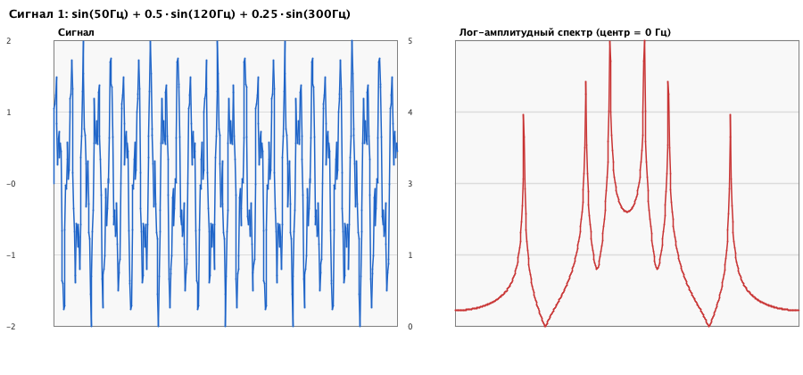

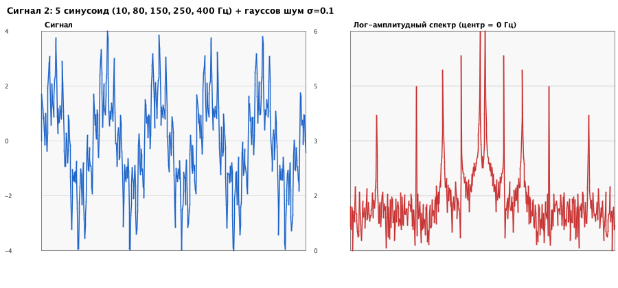

### 2D — синтетические изображения

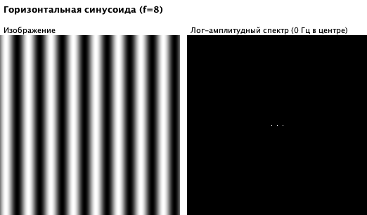

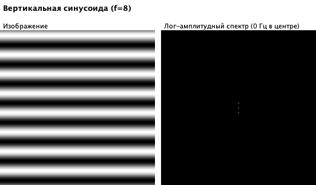

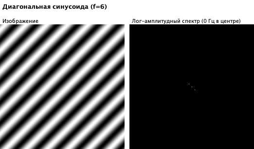

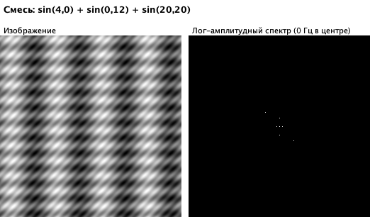

### 2D — реальные изображения

| Исходное | Спектр Фурье | IFFT | Спектр Хаара |
|---|---|---|---|
|  | 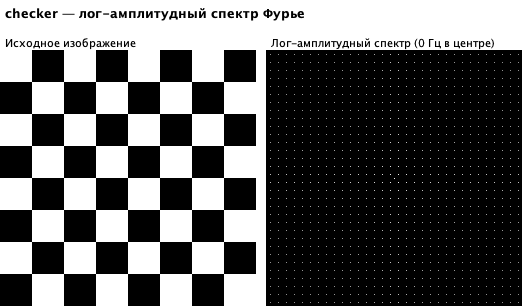 | 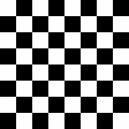 | 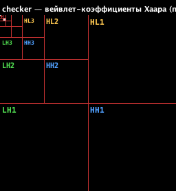 |
| 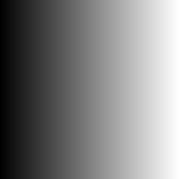 | 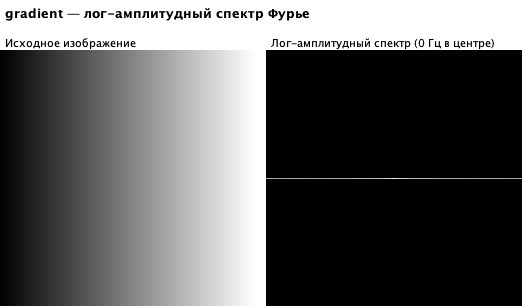 |  | 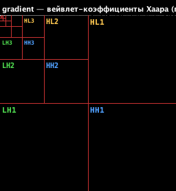 |
|  | 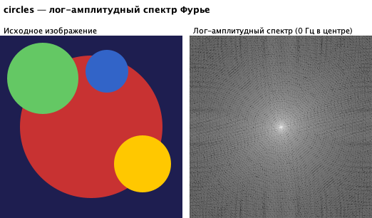 | 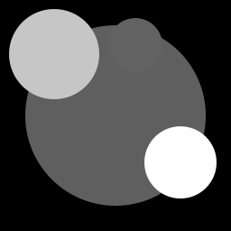 | 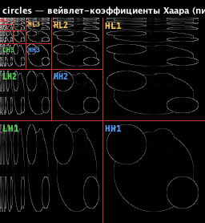 |
|  | 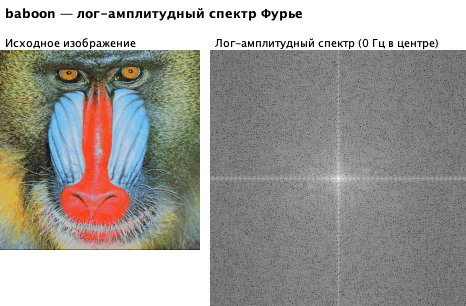 | 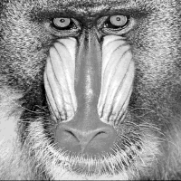 | 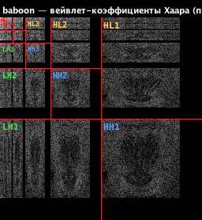 |
|  | 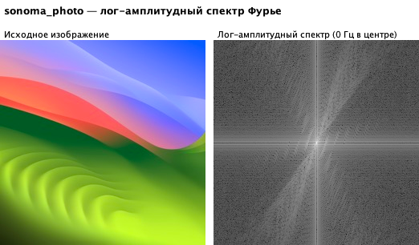 | 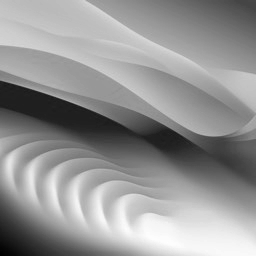 | 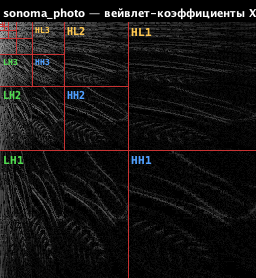 |

### Сравнение спектров Фурье и Хаара

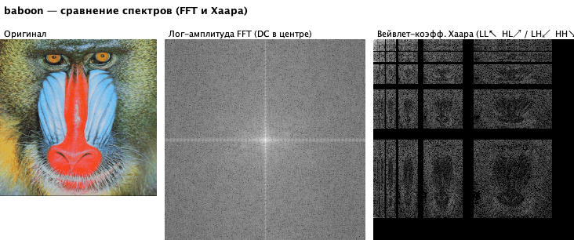

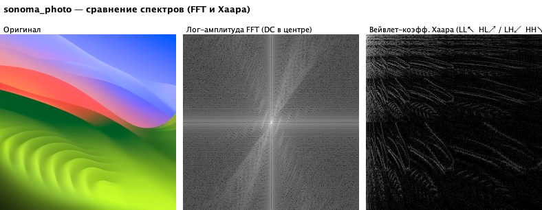

### Спектр Хаара — 1D сигналы

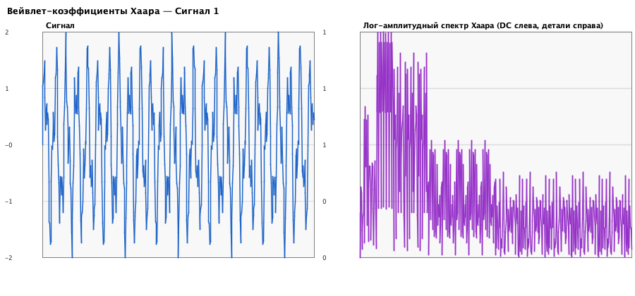

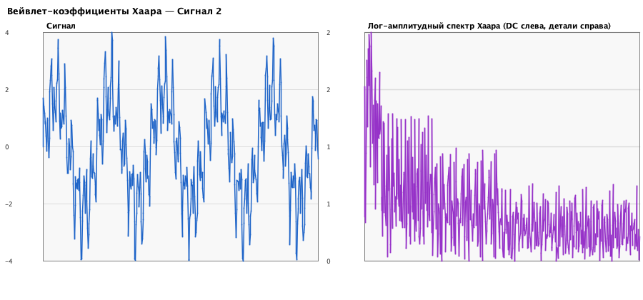

### Спектр Хаара — синтетические изображения

| sin_horizontal | sin_vertical | sin_diagonal | sin_mix |
|---|---|---|---|
|  | 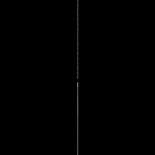 | 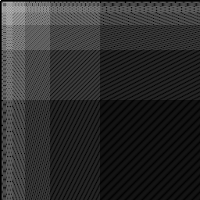 | 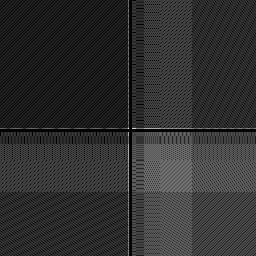 |

---

## Лабораторная работа №3 — Геометрические преобразования и интерполяция

### Поворот

**baboon:**

| 30° | 45° | 90° | 135° |
|---|---|---|---|
| 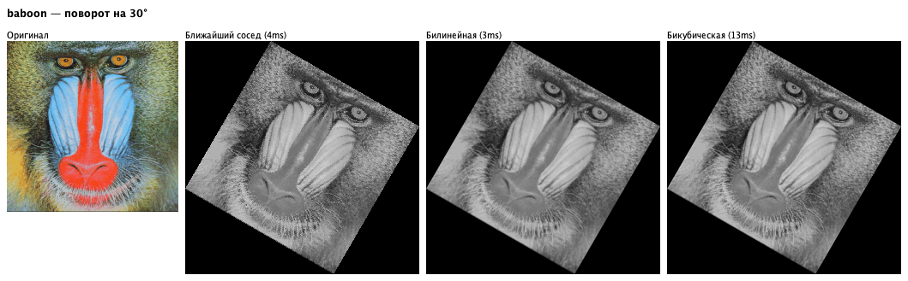 | 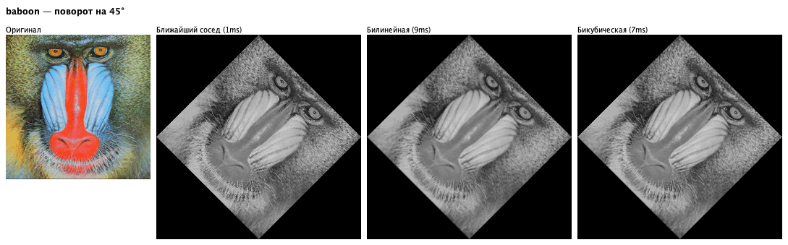 | 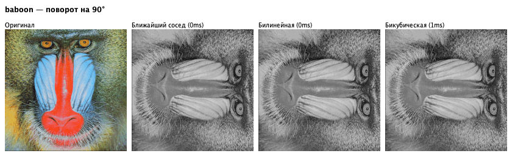 | 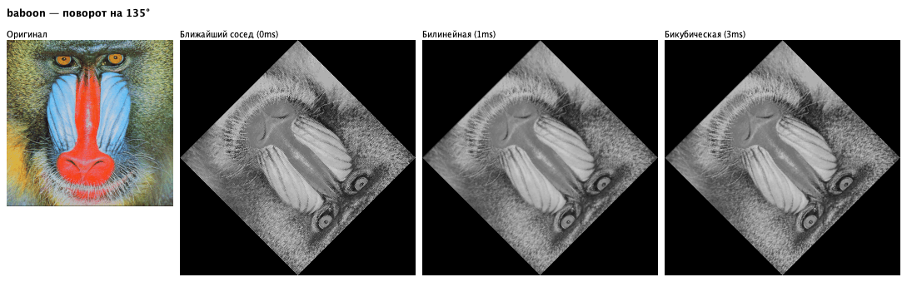 |

**checker:**

| 30° | 45° | 90° | 135° |
|---|---|---|---|
| 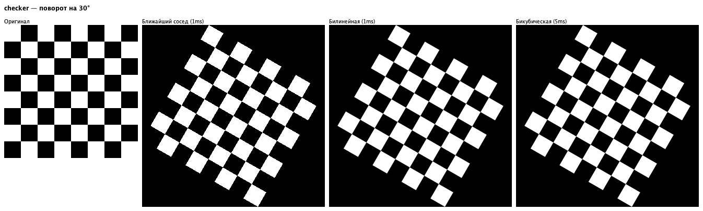 | 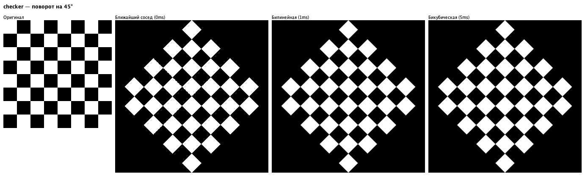 | 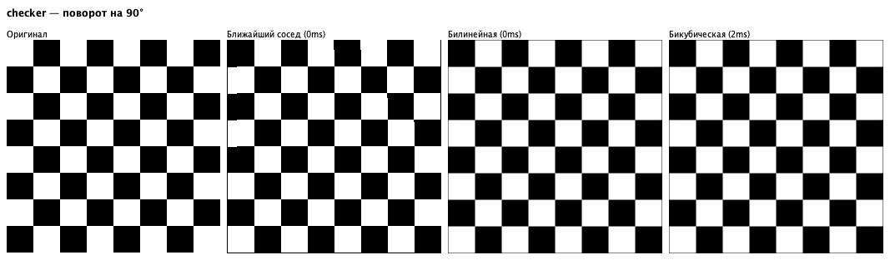 | 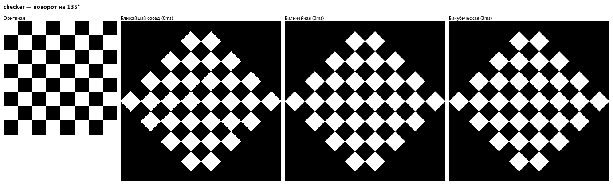 |

**circles:**

| 30° | 45° | 90° | 135° |
|---|---|---|---|
| 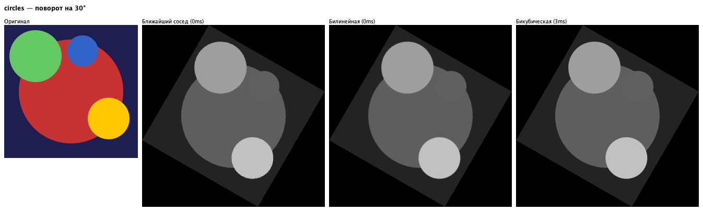 | 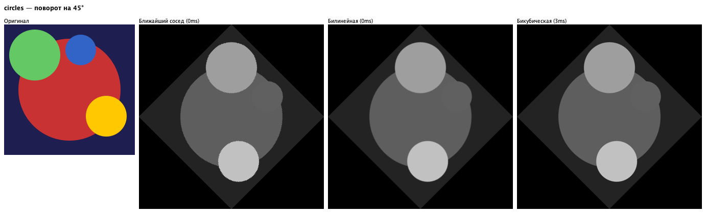 | 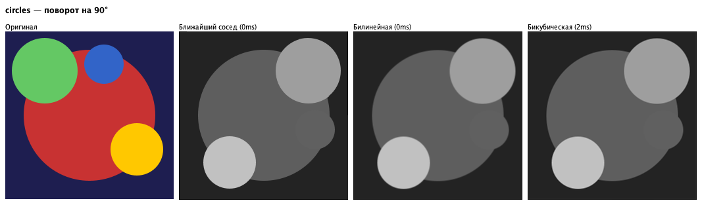 |  |

**gradient:**

| 30° | 45° | 90° | 135° |
|---|---|---|---|
|  |  |  |  |

**sonoma_photo:**

| 30° | 45° | 90° | 135° |
|---|---|---|---|
|  |  |  |  |

### PSNR vs Bilinear

| Изображение | Угол | NN | Бикубическая |
|---|---|---|---|
| baboon | 30° | 31.5 дБ | 41.8 дБ |
| baboon | 45° | 32.4 дБ | 42.0 дБ |
| baboon | 90° | 100.0 дБ | 100.0 дБ |
| checker | 30° | 25.5 дБ | 36.8 дБ |
| checker | 45° | 25.6 дБ | 37.2 дБ |
| checker | 90° | 18.2 дБ | 33.2 дБ |
| circles | 30° | 40.9 дБ | 52.1 дБ |
| circles | 45° | 40.6 дБ | 52.3 дБ |
| gradient | 30° | 35.4 дБ | 46.8 дБ |
| gradient | 45° | 32.6 дБ | 47.1 дБ |
| sonoma_photo | 30° | 36.6 дБ | 48.1 дБ |
| sonoma_photo | 45° | 34.1 дБ | 48.4 дБ |

### Скос (shear)

| baboon | checker | circles |
|---|---|---|
|  |  |  |

### Поворот + масштабирование (45°, ×1.5)

| baboon | checker | sonoma_photo |
|---|---|---|
|  |  |  |

### Поворот in-situ (3 скоса, 45°)

| baboon | checker | circles |
|---|---|---|
|  |  |  |

| gradient | sonoma_photo |
|---|---|
|  |  |

| Изображение | PSNR(in-situ vs билинейная, оба — прямой поворот 45°) |
|---|---|
| baboon | 19.25 дБ |
| checker | 17.36 дБ |
| circles | 31.22 дБ |
| gradient | 18.55 дБ |
| sonoma_photo | 19.27 дБ |

In-situ поворот через три скоса использует целочисленные сдвиги строк/столбцов — O(1) памяти, но точность ограничена ближайшим соседом. PSNR показывает отличие от билинейного метода (оба — прямой поворот на 45°).

---

## Лабораторная работа №4 — Свёртка

### ФНЧ

**baboon:**

**circles:**

**gradient:**

**sonoma_photo:**

### ФВЧ, zero-crossing, резкость

**baboon:**

**circles:**

**gradient:**

**sonoma_photo:**

### PSNR фильтрации (дБ)

| Изображение | Шум | Box 3×3 | Box 7×7 | Gauss σ=2 | Порог | Bilateral |
|---|---|---|---|---|---|---|
| baboon | Гауссов σ²=400 | 24.76 | 23.05 | 23.68 | 24.33 | **25.99** |
| baboon | Импульс 10% | 22.31 | 22.47 | 22.97 | 15.52 | 17.63 |
| circles | Гауссов σ²=400 | 30.37 | 30.11 | 30.98 | 26.11 | **30.48** |
| circles | Импульс 10% | 23.53 | 26.42 | **26.70** | 15.09 | 15.84 |
| gradient | Гауссов σ²=400 | 31.56 | **38.78** | 38.51 | 26.26 | 31.13 |
| gradient | Импульс 10% | 23.39 | **27.91** | 27.79 | 14.77 | 15.43 |
| sonoma_photo | Гауссов σ²=400 | 31.25 | 34.31 | **34.95** | 26.08 | 30.42 |
| sonoma_photo | Импульс 10% | 24.72 | 29.45 | **29.55** | 15.63 | 17.32 |

### Билатеральный фильтр

**baboon:**

**circles:**

**gradient:**

**sonoma_photo:**

### Морфологический градиент (нелинейный ФВЧ)

**baboon:**

**circles:**

**gradient:**

### Оптимальный σ гауссова фильтра

| Изображение | Гауссов шум | Импульсный шум |
|---|---|---|
| baboon | σ=0.75, PSNR=26.08 дБ | σ=1.25, PSNR=23.29 дБ |
| circles | σ=1.25, PSNR=31.73 дБ | σ=2.00, PSNR=26.72 дБ |
| gradient | σ=5.00, PSNR=45.39 дБ | σ=5.00, PSNR=29.73 дБ |
| sonoma_photo | σ=2.00, PSNR=34.95 дБ | σ=3.00, PSNR=30.21 дБ |

**baboon:**

**circles:**

**gradient:**

**sonoma_photo:**

### Выводы

#### Фильтрация гауссового шума (σ²=400)

- **Box 3×3** хорошо работает на детальных изображениях (baboon: 24.76 дБ), но слабее на гладких.
- **Box 7×7** выигрывает на гладких изображениях (gradient: 38.78 дБ), но размывает мелкие структуры.
- **Гауссов σ=2** — лучший баланс среди линейных фильтров, рекомендован как стандартный НЧ-фильтр.
- **Билатеральный** — лучший на детальных изображениях (baboon: 25.99 дБ), сохраняет границы. На гладких уступает Box 7×7 (gradient: 31.13 vs 38.78 дБ), т.к. граничная функция там ничего не даёт.
- **Оптимальный σ** — даёт существенный выигрыш (gradient: 45.39 дБ при σ=5.0 vs 38.78 при σ=2). Параметр σ должен подбираться под изображение.

#### Фильтрация импульсного шума (10% соль/перец)

- **Box и Гауссов** частично подавляют шум (23–30 дБ), но не устраняют полностью.
- **Пороговый фильтр t=50: ~15 дБ — результат хуже исходного зашумлённого изображения.** Причина: если центральный пиксель сам является шумом (0 или 255), порог исключает корректных соседей и фильтр вырождается. Для импульсного шума нужен **медианный фильтр** (нелинейный).

#### Детектирование границ

- **Лапласиан** — быстрый, но реагирует на шум. Пригоден только на чистых изображениях.
- **LoG + zero-crossing** — гауссово размытие подавляет шум перед лапласианом; zero-crossing даёт **тонкие замкнутые контуры**. Рекомендован для точного детектирования.
- **Морфологический градиент** (дилатация − эрозия) — нелинейный, устойчив к шуму, но контуры шире. Хорош для выделения крупных объектов. Размер ядра управляет масштабом детектируемых структур.

#### Сводная таблица рекомендаций

| Задача | Рекомендуемый фильтр |
|---|---|
| Гауссов шум, детальное изображение | Билатеральный или Гауссов (подобранный σ) |
| Гауссов шум, гладкое изображение | Box 7×7 или Гауссов (большой σ) |
| Импульсный шум (соль/перец) | Медианный (нелинейный); Box как паллиатив |
| Детектирование границ | LoG + zero-crossing |
| Выделение крупных объектов | Морфологический градиент |
| Повышение резкости | Unsharp masking (на предварительно сглаженном) |
| Быстрая обработка больших изображений | Box через интегральное изображение — O(1) |

---

## Лабораторная работа №5 — Цветовые пространства

### Каналы RGB, HSV, YCbCr, CIELab

**baboon:**

**sonoma_photo:**

**circles:**

**checker:**

### Выравнивание гистограммы

**baboon:**

**sonoma_photo:**

**circles:**

**checker:**

### Баланс белого

| baboon | sonoma_photo | circles | checker |
|---|---|---|---|
|  |  |  |  |

### Цветовая квантизация (k-means)

**baboon:**

**sonoma_photo:**

**circles:**

**checker:**

### Сдвиг оттенка

**baboon:**

**sonoma_photo:**

**circles:**

**checker:**

### Хроматический ключ

**baboon:**

**sonoma_photo:**

**circles:**

**checker:**

---

### Выводы

#### Точность конвертации

RMSE = 0.0000 для всех пространств (RGB↔HSV, RGB↔YCbCr, RGB↔CIELab). Конвертации реализованы без потерь — можно переходить между пространствами для обработки и возвращаться в RGB без артефактов.

#### Эквализация гистограммы

| Метод | Результат |
|---|---|
| RGB (все каналы независимо) | Нарушает баланс R/G/B → **искажает цветность**, результат неестественный |
| HSV (канал V) | Повышает контраст, сохраняет оттенок H и насыщенность S |
| **YCbCr (канал Y)** | **Лучший результат**: контраст улучшен, цвета визуально не изменены |

**Вывод:** для эквализации цветных изображений следует обрабатывать только яркостный канал — YCbCr(Y).

#### Выбор цветового пространства по задаче

| Задача | RGB | HSV | YCbCr |
|---|---|---|---|
| Эквализация гистограммы | плохо | удовлетворительно | **хорошо** |
| Сдвиг оттенка | сложно | **просто (канал H)** | сложно |
| Хромакей (удаление фона по цвету) | плохо | **хорошо (H + S)** | плохо |
| Раздельная обработка яркости/цвета | нельзя | можно | **лучше** |
| Баланс белого | напрямую | сложнее | напрямую |

- **HSV** незаменим для задач, работающих с оттенком: хромакей (green ≈ 120°, фильтрация по H и S) и сдвиг тона.
- **YCbCr** лучший для раздельной обработки яркости и цвета (эквализация, сжатие).
- **CIELab** перцептуально равномерен (ΔE ≈ видимое различие), но вычислительно дороже и не даёт преимуществ в простых операциях.

#### Цветовая квантизация (k-means)

- **k=4**: сильная постеризация, цвета грубо усреднены.
- **k=8**: заметные, но терпимые артефакты.
- **k=16**: визуально приемлемо для большинства изображений.

Кластеризация в RGB-пространстве субоптимальна из-за неравномерности восприятия; в практических задачах лучше использовать CIELab.
